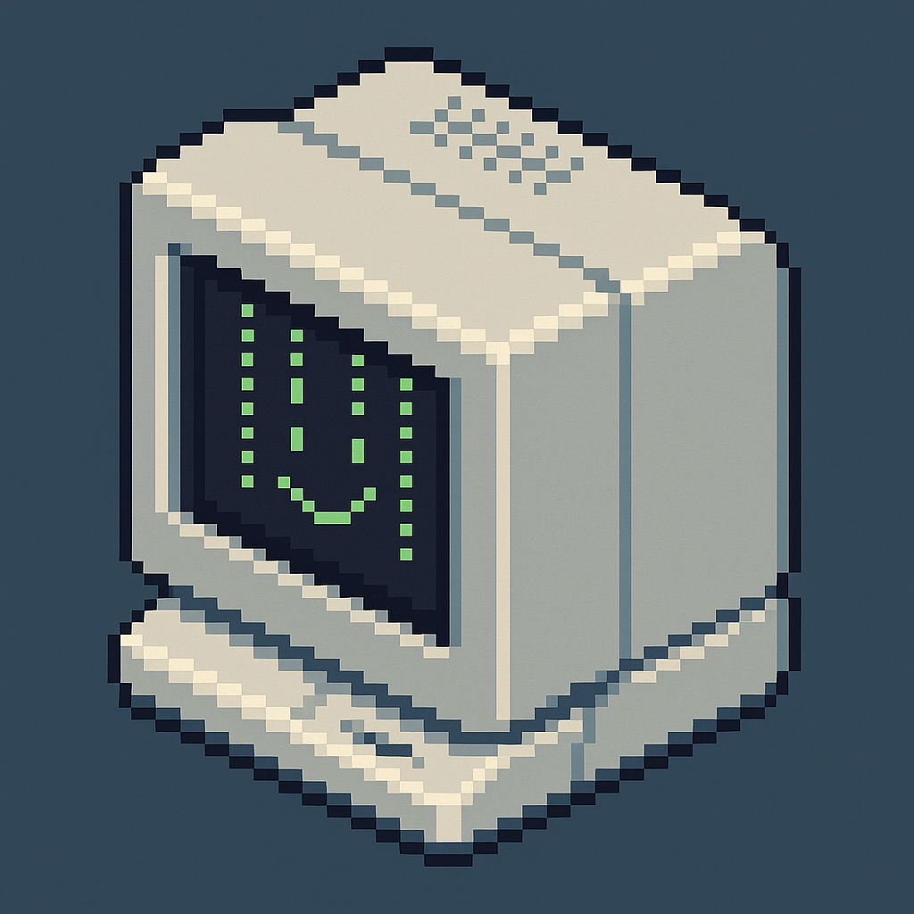

# Mini Retro Computer (MRP)



This repository contains code that allows an ESP + Display + Housing to act like
a little retro computer.


https://github.com/user-attachments/assets/a31ec884-594a-451a-a3d0-bb570fb42967

<!-- markdown-toc start - Don't edit this section. Run M-x markdown-toc-refresh-toc -->
**Table of Contents**

- [Mini Retro Computer (MRP)](#mini-retro-computer-mrp)
  - [Configure](#configure)
  - [Build and Flash](#build-and-flash)
  - [Output](#output)

<!-- markdown-toc end -->

## Configure

This project can run on either a `Byte90` or a `Waveshare ESP32-S3 TouchLCD`
board.

You can configure which board to use by running `idf.py menuconfig`.

## Build and Flash

Build the project and flash it to the board, then run monitor tool to view serial output:

```
idf.py -p PORT flash monitor
```

(Replace PORT with the name of the serial port to use.)

(To exit the serial monitor, type ``Ctrl-]``.)

See the Getting Started Guide for full steps to configure and use ESP-IDF to build projects.

## Output

Example screenshot of the console output from this app:


Waveshare ESP32-S3 TouchLCD board:

https://github.com/user-attachments/assets/19fd89e8-21b9-4e14-b6dd-c13d6cd386b7


Byte90:

https://github.com/user-attachments/assets/bb0ec5d7-b37c-44e3-a923-53e971ec151f

Older images:


https://github.com/user-attachments/assets/b5ee313d-070f-4589-8a12-f9fa04875219
